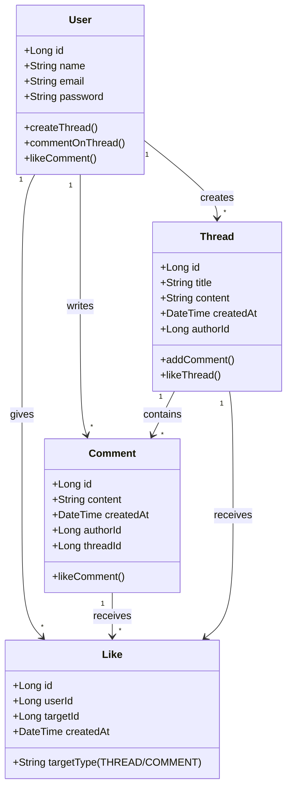

# Fórum - API RESTful
Uma API RESTful para um fórum de discussão dentro de um portal corporativo, criada para fins de estudo.

## Descrição
Esta API permite que usuários participem de discussões, criando tópicos, comentando e interagindo por meio de curtidas. O objetivo é explorar boas práticas no desenvolvimento de APIs RESTful usando Java e Spring Boot.

## Funcionalidades
- Gerenciamento de usuários (cadastro, autenticação)
- Criação e listagem de tópicos de discussão
- Adição e visualização de comentários
- Sistema de curtidas em tópicos e comentários

## 🛠 Tecnologias Utilizadas
- Java 21;
- Spring Boot 3;
- Spring Data JPA;
- Spring Security;
- Swagger/OpenAPI (para documentação);
- Railway.

## Diagrama de classes 

